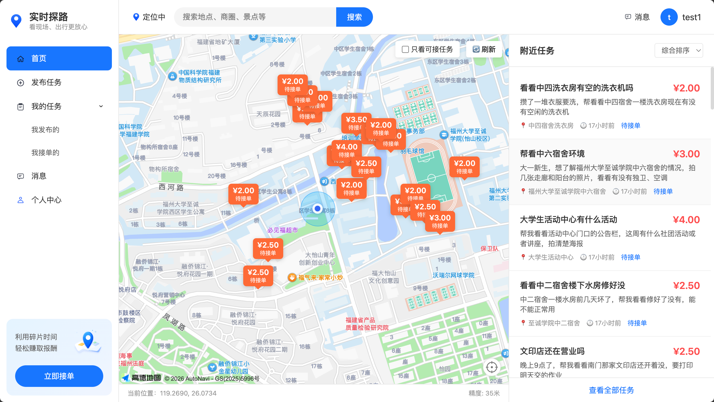
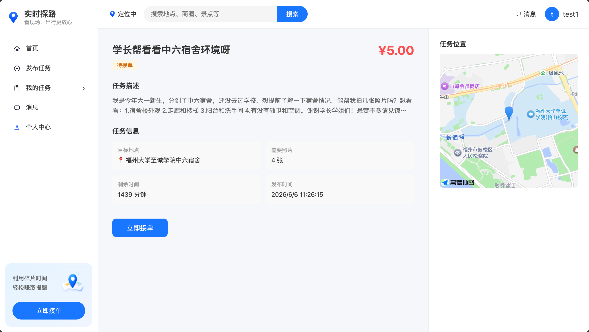
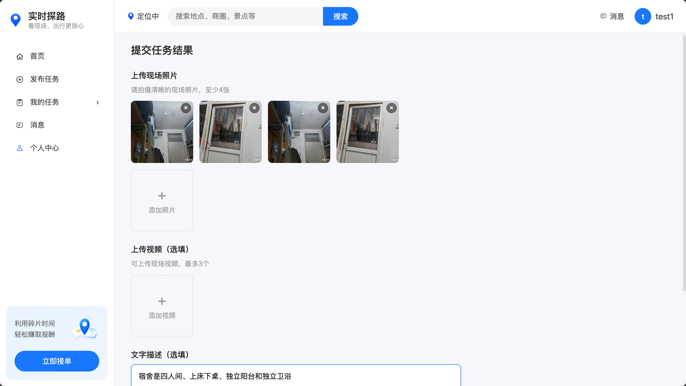
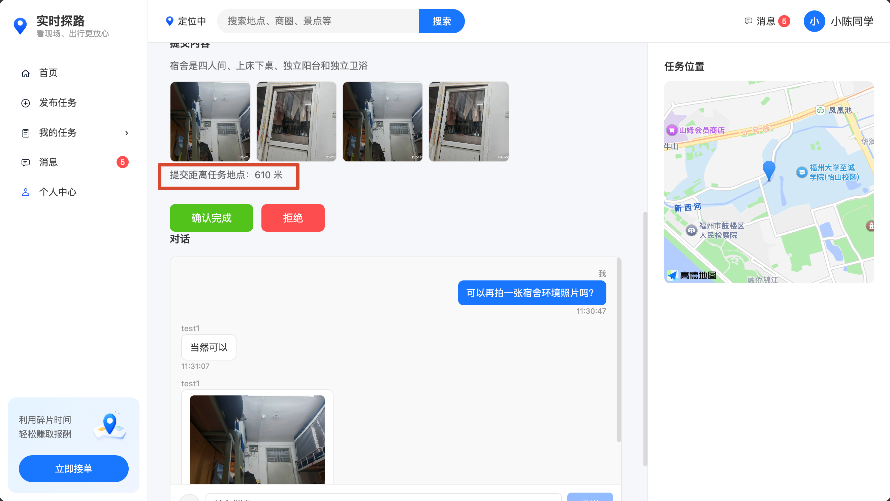
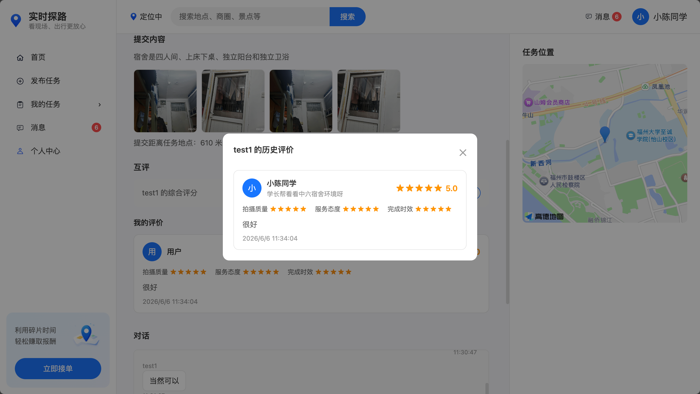

# 实时探路

### 出发之前，先看一眼。

---

## 你一定经历过这样的周末

周六早上，你刷到了美团上动物园的团购券。孩子听到消息，兴奋得跳了起来。

<p align="center">
  
  
  
</p>

你们收拾好东西，满怀期待地出发了。

开了四十分钟的车，终于到了。可眼前的景象让你心凉了半截——**人山人海**。

<p align="center">
  
  
  
</p>

停车场满了，门口排着看不到尽头的队伍。太阳暴晒，孩子开始烦躁。

你开始犹豫：排下去？至少还要一个小时。走？孩子的期待怎么办？

最终你们选择了离开。

<p align="center">
  
  
  
</p>

<p align="center">
  
</p>

> **浪费的不只是时间和油钱，更是孩子满心的期待。**

---

## 如果，出发前你就能知道呢？

同样的周六早上，你同样刷到了那张团购券。

但这次，你打开了**「实时探路」**，发布了一个任务：

> *"帮我看看动物园现在排队情况怎么样，人多吗？"*

几分钟后，一位刚好在动物园附近的游客接了你的单。他发来了现场照片，并告诉你：

> *"人超多的，门口排队至少要40分钟，里面也到处是人，建议换个时间来。"*

<p align="center">
  
  
  
</p>

你把这件事告诉了孩子，你们一起商量了新的计划——**去郊外野餐！**

<p align="center">
  
  
  
</p>

<p align="center">
  
  
</p>

> **一笔小小的悬赏，换回了一家人的好心情。**

---

## 网上的照片，你真的敢信吗？

你和闺蜜计划了一次周末旅行，打开App挑酒店。

找到一家看起来不错的——宣传图精致、评分也挺高。虽然翻到几条差评说"跟图片不一样"，但好评那么多，应该没问题吧？

可你心里其实清楚：**很多好评是刷的**。你也想过去小红书搜搜真实评价，但打开一看——满屏都是广告和软文推广，根本分不清哪条是真的。

<p align="center">
  
  
  
</p>

<p align="center">
  
  
  
</p>

算了，宣传图确实好看，就它了。你们满怀期待地出发。

到了酒店，迫不及待打开房门——结果和宣传图**完全不一样**。房间比想象中小很多，装修陈旧，灯光昏暗，跟精心修图的宣传照简直是两个地方。

<p align="center">
  
  
  
</p>

<p align="center">
  
</p>

退房？钱已经付了，不给退。忍着住？一整晚都别扭。

**其实那几条差评说的都是真的，只是被刷出来的好评淹没了。**

### 如果你提前用了「实时探路」呢？

订房之前，你发布了一个任务：

> *"有没有人刚好住在XX酒店？帮我拍一下房间真实环境，跟宣传图差别大吗？"*

刚好有一位在美团订了同一家酒店的住客看到了你的任务。他随手拍了几张真实的照片发给你——房间实景、窗外环境、走廊灯光，所见即所得。

**跟小红书和平台评论不同**，实时探路通过GPS定位验证，确保回答者**真的在那个地方**。不是广告，不是软文，不是几个月前的过期信息——就是此时此刻的真实情况。

---

## 实时探路是什么？

一句话概括：**花几块钱，让已经在那里的人帮你看一眼。**

它连接两类人：
- **想了解某地实况的人**（发布者）——出发前想知道目的地真实情况
- **正在该地附近的人**（接单者）——顺手拍几张照片就能赚零花钱

### 产品界面

<p align="center">
  
  
  
</p>

<p align="center">
  
  
</p>

---

## 核心流程

```
① 发布任务 → ② 附近推送 → ③ 接单前往 → ④ 拍照提交 → ⑤ 确认收货 → ⑥ 赏金到账
```

### 关键规则

| 机制 | 说明 |
|------|------|
| GPS定位校验 | 接单和提交时，设备定位需在任务地点 **1000米** 范围内 |
| 资金托管 | 发布任务时悬赏金预冻结，确认后才发放给接单者 |
| 最低悬赏 | **0.01元** 起 |
| 时效保护 | 任务过期自动关闭并退款 |
| 自动确认 | 提交后24小时未操作自动确认支付 |
| 实时聊天 | 发布者可追加问题，接单者实时回复 |
| 双向评价 | 任务完成后双方互评 |

---

## 为什么需要实时探路？

| 现有方案 | 局限性 | 实时探路 |
|----------|--------|----------|
| 平台评论 | 好评可能是刷的，差评被淹没 | GPS定位验证，**确保真实** |
| 小红书 | 广告软文太多，难辨真假 | 没有广告，**按需定制** |
| 问朋友 | 朋友不一定在那个地方 | 总有人**正在那里** |
| 自己跑一趟 | 时间成本、交通成本 | **几块钱**搞定 |
| 看宣传图 | 精心修图，与实际不符 | **真实无滤镜**的现场 |

---

## 图标

<p align="center">
  
  
  
  
  
  
  
  
  
  
  
  
</p>

---

<p align="center">
  
</p>

<h3 align="center">每一次出行，都应该是快乐的。</h3>

<p align="center"><i>出发之前，先帮你看一眼。</i></p>
